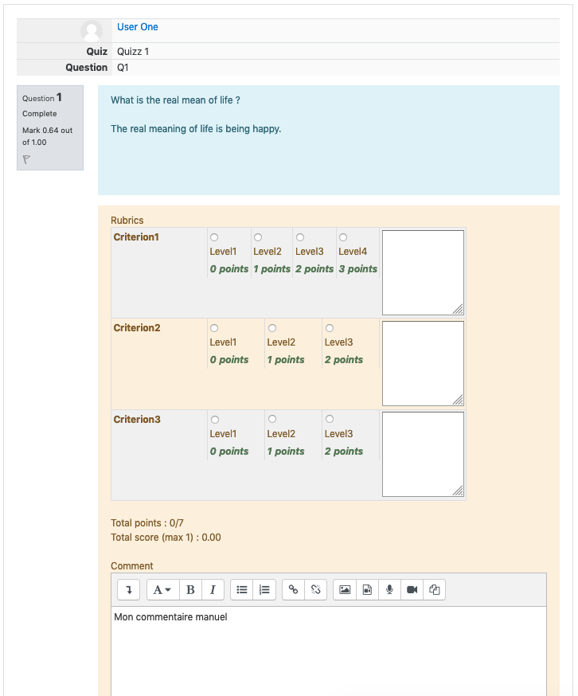

# RubricGraded question behaviour

The RubricGraded question behaviour extends the manual graded behaviour and allows
you to link a rubric (created in assignment activity) to a rubric graded essay
question (see "rgessay" question type).

When grading manually the teacher can check levels in the rubric, and a grade is 
automatically calculated. The rubric's filling is also saved in database.  

[//]: # "Lorem ipsum dolor sit amet, consectetur adipiscing elit. Nam condimentum vulputate
         lectus at euismod. Suspendisse lorem quam, dapibus id eleifend non, accumsan aliquam
         risus. Maecenas urna turpis, rhoncus et commodo non, ullamcorper sed magna. Praesent 
         in dapibus justo. Quisque volutpat enim bibendum maximus volutpat. Aliquam lobortis 
         leo sed mauris sodales mattis. Nulla vestibulum eu felis at auctor."

[//]: # "Sed blandit nibh eget auctor pharetra. Nullam non neque molestie felis iaculis luctus. 
         Duis eget efficitur ante. Fusce non nibh in nisl vestibulum consectetur in eu dui. 
         Donec cursus magna mauris, id eleifend sem tempor ut. Curabitur quis mauris id sem 
         accumsan volutpat. Vivamus vestibulum sollicitudin velit vel hendrerit. Phasellus 
         aliquam molestie odio, et ullamcorper diam eleifend et. Nunc non finibus libero. "

## Installation

The RubricGraded question behaviour depends on the "rubric graded essay" question type.
First install
[Question type > RG Essay](https://github.com/a-camacho/moodle-qt-rgessay).

The simplest way to install the RubricGraded question behaviour plugin is going to the 
*Site administration -> Plugins -> Install plugins* page. 

## Notes

##### About rubric form creation

For setting up a rubric form, you have to create an "Assignment" type activity. You then can set
up a rubric form for this activity. Unfortunately only one rubric form can be created on an "assignment"
activity, **but** :

  1. Rubrics can be saved as a template (and then reused later without keeping any activity).
  _**Warning**_ : _templates will be available by other users in other courses_
  2. Rubrics can also be added to an activity which is deleted later. Rubric stays in database and is not
  shared with other users.
  
_NB : If a rubric is deleted from an activity and has not been saved as template it will be lost._
  
## FAQ

## License

[GNU GPL v3 or later](http://www.gnu.org/copyleft/gpl.html) 

## Moodle Version

Supported is Moodle v3. Not tested with Moodle v2.

## Copyright

[André Camacho](https://www.camacho.pt) pour l'[Université de Genève](https://www.unige.ch/)